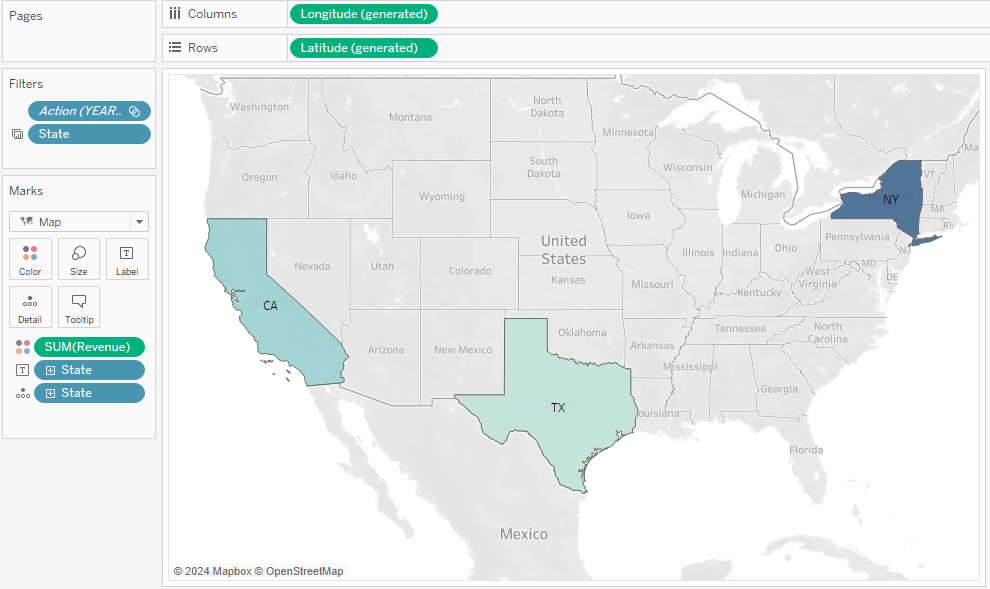

# Data Portfolio: Gear Shift Revenue analysis


Table of Contents
- [Objective](#objective)
- [Data Source](#data-source)
- [Stages](#stages)
- [Design](#design)
  - [Tools](#tools)
- [Development](#development)
  - [Pseudocode](#pseudocode)
  - [Data Exploration](#data-exploration)
  - [Transform the Data](#transform-the-data)
- [Visualization](#visualization)
- [Analysis](#analysis)
  - [Findings](#findings)
- [Recommendations](#recommendations)


# Objective

-   What is the key pain point

The company's management seeks to enhance their understanding of sales performance and identify trends within their sales data from 2016 to 2018. By delving into various dimensions of sales activity, they aim to extract actionable insights to inform strategic decisions

-   What is the ideal solution? To create a dashboard that provides insights into sales and profit for across all regions. including their
-   Revenue per Year
-   Revenue per Month
-   Total Units Sold
-   Number of Customers

This will help management know the most profitable stores over the past three years and how to improve the less profitable stores.

# Data Source

-   What data is needed to achieve our objective?

We need data on the sales performance including their:\
- Revenue per Store - Revenue per product - Revenue per Sales Rep - Top Customers

Where is the data coming from? The data is a sample dataset. I created a script with data and loaded it into MYSQL.

 [click here to download it.](https://www.sqlservertutorial.net/wp-content/uploads/SQL-Server-Sample-Database.zip)
# Stages

Design Development Analysis

## Design

Dashboard components required

-   What should the dashboard contain based on the requirements provided?

To understand what it should contain, we need to figure out what questions we need the dashboard to answer:

1.  What is the total revenue from 2016 to 2018?
2.  What is the revenue per month from 2016 to 2018?
3.  What is the revenue per state?
4.  What is the revenue per store?
5.  What are the most profitable brands?
6.  Who are the top customers?
7.  Who is the top-performing sales representative?

For now, these are some of the questions we need to answer, this may change as we progress down our analysis.

## Tools

| Tool       | Purpose                                               |
|------------|-------------------------------------------------------|
| Excel      | Exploring the data                                    |
| SQL Server | Cleaning, testing, and analyzing the data             |
| Tableau    | Visualizing the data via interactive dashboards       |
| GitHub     | Hosting the project documentation and version control |

# Development

## Pseudocode

-   What's the general approach in creating this solution from start to finish?

1.  Get the data
2.  Explore the data in Excel
3.  Load the data into SQL Server
4.  Clean the data with SQL
5.  Test the data with SQL
6.  Visualize the data in Tableau
7.  Generate the findings based on the insights
8.  Write the documentation + commentary
9.  Publish the data to GitHub Pages

# Data Creation

After downloading the dataset, I applied the following steps. 1. Opened SQL server, created a new database, and named it Bikestores 2. Select the new Bikestores database in the SQL server. 3. Open the 'create objects' query file and then execute it in the SQL server for the BikeStores database. 4. Opened the 'load data' query file and then executed it in the SQL server for the database.'

## Data exploration notes

This is the stage where you have a scan of what's in the data, errors, inconsistencies, bugs, weird and corrupted characters, etc

-   What are your initial observations with this dataset? What's caught your attention so far?

1.  The required fields are scattered around nine tables. so I would have to join the tables to extract the data.

2.  The primary key in one table is a foreign key in another so we can join them together.

### Transform the data

``` SQL
/*
# 1. Select id, customer name, city state order_date
# 2. We need the sales volume and the total revenue generated
# 3. Next, we add the name of the products 
# 4. Next, I'll add the category of the products that were purchased.
# 5. I'll then add the stores in which the sales took place
# 6. I'll then add the sales rep that made the sale
*/

-- 1.
SELECT
  ord.order_id,
  CONCAT(cus.first_name, ' ', cus.Last_name),
  cus.city,
  cus.state,
  ord.order_date
FROM sales.orders ord
JOIN sales.customers cus
ON ord.customer_id = cus.customer_id

-- 2.
SELECT
    ord.order_id,
    CONCAT(cus.first_name, ' ', cus.Last_name),
    cus.city,
    cus.state,
    ord.order_date,
    SUM(ite.quantity) AS 'Total_units',
    SUM(ite.quantity * ite.list_price) AS 'Revenue'
FROM sales.orders ord
JOIN sales.customers cus
ON ord.customer_id = cus.customer_id
JOIN sales.order_items ite
ON ord.order_id = ite.order_id
GROUP BY
    ord.order_id,
    CONCAT(cus.first_name, ' ', cus.Last_name),
    cus.city,
    cus.state,
    ord.order_date

-- 3.
SELECT
    ord.order_id,
    CONCAT(cus.first_name, ' ', cus.Last_name) AS 'Customer_Name',
    cus.city,
    cus.state,
    ord.order_date,
    SUM(ite.quantity) AS 'Total_units',
    SUM(ite.quantity * ite.list_price) AS 'Revenue',
    pro.product_name
FROM sales.orders ord
JOIN sales.customers cus
ON ord.customer_id = cus.customer_id
JOIN sales.order_items ite
ON ord.order_id = ite.order_id
JOIN production.products pro
ON ite.product_id = pro.product_id
GROUP BY
    ord.order_id,
    CONCAT(cus.first_name, ' ', cus.Last_name),
    cus.city,
    cus.state,
    ord.order_date,
    pro.product_name
    
-- 4.
SELECT
    ord.order_id,
    CONCAT(cus.first_name, ' ', cus.Last_name) AS 'Customer_Name',
    cus.city,
    cus.state,
    ord.order_date,
    SUM(ite.quantity) AS 'Total_units',
    SUM(ite.quantity * ite.list_price) AS 'Revenue',
    pro.product_name,
    cat.category_name
FROM sales.orders ord
JOIN sales.customers cus
ON ord.customer_id = cus.customer_id
JOIN sales.order_items ite
ON ord.order_id = ite.order_id
JOIN production.products pro
ON ite.product_id = pro.product_id
JOIN production.categories cat
ON pro.category_id = cat.category_id
GROUP BY
    ord.order_id,
    CONCAT(cus.first_name, ' ', cus.Last_name),
    cus.city,
    cus.state,
    ord.order_date,
    pro.product_name,
    cat.category_name
    
-- 5.
SELECT
    ord.order_id,
    CONCAT(cus.first_name, ' ', cus.Last_name) AS 'Customer_Name',
    cus.city,
    cus.state,
    ord.order_date,
    SUM(ite.quantity) AS 'Total_units',
    SUM(ite.quantity * ite.list_price) AS 'Revenue',
    pro.product_name,
    cat.category_name,
    sto.store_name
FROM sales.orders ord
JOIN sales.customers cus
ON ord.customer_id = cus.customer_id
JOIN sales.order_items ite
ON ord.order_id = ite.order_id
JOIN production.products pro
ON ite.product_id = pro.product_id
JOIN production.categories cat
ON pro.category_id = cat.category_id
JOIN sales.stores sto
ON ord.store_id = sto.store_id
GROUP BY
    ord.order_id,
    CONCAT(cus.first_name, ' ', cus.Last_name),
    cus.city,
    cus.state,
    ord.order_date,
    pro.product_name,
    cat.category_name,
    sto.store_name
    
-- 6.
SELECT
    ord.order_id,
    CONCAT(cus.first_name, ' ', cus.Last_name) AS 'Customer_Name',
    cus.city,
    cus.state,
    ord.order_date,
    SUM(ite.quantity) AS 'Total_units',
    SUM(ite.quantity * ite.list_price) AS 'Revenue',
    pro.product_name,
    cat.category_name,
    sto.store_name,
    CONCAT(sta.first_name, ' ', sta.last_name) AS 'Sales-rep',
    bra.brand_name
FROM sales.orders ord
JOIN sales.customers cus
ON ord.customer_id = cus.customer_id
JOIN sales.order_items ite
ON ord.order_id = ite.order_id
JOIN production.products pro
ON ite.product_id = pro.product_id
JOIN production.categories cat
ON pro.category_id = cat.category_id
JOIN sales.stores sto
ON ord.store_id = sto.store_id
JOIN sales.staffs sta
ON ord.staff_id = sta.staff_id
JOIN production.brands bra
ON pro.brand_id = bra.brand_id
GROUP BY
    ord.order_id,
    CONCAT(cus.first_name, ' ', cus.Last_name),
    cus.city,
    cus.state,
    ord.order_date,
    pro.product_name,
    cat.category_name,
    sto.store_name,
    CONCAT(sta.first_name, ' ', sta.last_name),
    bra.brand_name
```
### Final Query

## Import 
- Create a new Microsoft Excel file
- Connect it to the SQL server
- Import the data into Excel 


# Check if the data is in the right format.

All the data are in the correct format.

# Creating the Charts

1.  Next I'll create 8 different pivot charts and create visualizations from those charts.
2.  The charts include

-   Total Revenue
-   Revenue per Month
-   Revenue per State
-   Revenue per Store
-   Revenue Per Brand
-   Revenue per Product Category
-   Top 10 Customers
-   Best-performing Sales Representatives

### Total Revenue & Total Revenue Per Month


### Revenue for Each State and Store


### Revenue for Each Brand and Product Category


### Top 10 Customers & Top Sales Representatives


3.  Create a Dashboard that includes slicers for management


# Import the Data Into Tableau to Create an Interactive Dashboard

1. Import the Excel version into Tableau
2. Confirm the data structure
3. Create a new worksheet for Revenue per Year

4. Revenue per Month

5. Revenue Per State

6. Revenue Per Store

7. Revenue per Brand

8. Revenue per Category

9. Top 10 Customers

10. Top Sales Rep


# Visualization 


## Results

- What does the dashboard look like?


 [click here to view it.](https://public.tableau.com/views/GearShiftDashboard/Dashboard1?:language=en-US&:sid=&:display_count=n&:origin=viz_share_link)


## Discovery

- What did we learn?

We discovered that 


1. 2017 was our most profitable year in business with off-the-charts profit.
2. Mountain bikes over the past three years were the most profitable product category.
3. Trek Mountain Bike was the most bought across all our stores.
4. New York was the highest-grossing state.
5. Marcelene Boyer made the most sales across all categories.


### Action plan
Certainly! Let's create an action plan based on the findings you've shared:

1. Leverage the Success of 2017:
- Analyze what made 2017 so profitable. Were there specific marketing strategies, product launches, or operational changes that contributed to the success? Consider replicating those successful tactics in the current year.
- Review financial reports and identify patterns or trends from 2017. Use this information to inform your decision-making going forward.

2. Focus on Mountain Bikes:
- Given that mountain bikes have been consistently profitable over the past three years, allocate more resources (both in terms of inventory and marketing efforts) to this product category.
- Consider expanding your mountain bike offerings by introducing new models or collaborating with popular brands.

3. Promote Trek Mountain Bikes:
- Since Trek Mountain Bike was the most purchased product across all your stores, create targeted marketing campaigns specifically for this brand.
- Highlight the unique features, quality, and benefits of Trek Mountain Bikes through social media, email newsletters, and in-store displays.

4. Target New York Customers:
- New York was the highest-grossing state. Invest in localized marketing efforts for this region.
- Collaborate with local influencers, participate in community events, and run geo-targeted online ads to attract New York customers.

5. Recognize Marcelene Boyer:
- Marcelene Boyer made the most sales across all categories. Show appreciation for her outstanding performance.
- Consider implementing an employee recognition program, offering incentives, or publicly acknowledging her achievements within your organization.

### What steps do we take to implement the recommended decisions effectively?
1. Leverage the Success of 2017:
- Analyze the Factors: Dive deeper into what contributed to the exceptional profitability in 2017. Was it a specific marketing campaign, product quality, or operational efficiency? Gather data and insights.
+ Replicate Successful Strategies: Identify the successful strategies and replicate them. For instance:
+ If a particular marketing channel (e.g., social media, email) worked well, allocate resources accordingly.
+ If a product launch was particularly successful, consider similar launches.
- Set Clear Goals: Define specific goals for the current year based on the 2017 success. For example:
+ Increase overall revenue by X%.
+ Achieve a specific profit margin.
+ Monitor Progress: Regularly track progress against these goals and adjust strategies as needed.

2. Focus on Mountain Bikes:
 - Inventory Management:
+ Ensure sufficient stock of mountain bikes.
+ Consider seasonal trends (e.g., summer months may see higher demand).
 - Marketing Efforts:
+ Create targeted marketing campaigns for mountain bikes:
+ Showcase features, durability, and benefits.
+ Use social media (Instagram, Facebook), email newsletters, and website banners.
 - Collaborate with Suppliers:
+ Work closely with suppliers to ensure timely availability of mountain bike models.
+ Explore exclusive deals or partnerships.

3. Promote Trek Mountain Bikes:
   - Content Creation:
     + Develop engaging content specifically for Trek Mountain Bikes:
     + High-quality images and videos.
     + Customer testimonials.
     + Comparison with other brands.
   - In-Store Displays:
     + Highlight Trek Mountain Bikes prominently in your physical stores.
     + Use eye-catching displays and signage.
   - Online Presence:
     + Optimize your website for Trek Mountain Bikes.
     + Use relevant keywords for search engine optimization (SEO).

4. Target New York Customers:
   - Localized Marketing:
     + Identify New York-specific marketing opportunities:
     + Collaborate with local influencers or bloggers.
     + Sponsor local events.
     + Participate in community fairs or markets.
   - Geo-Targeted Ads:
     + Run online ads specifically targeting New York customers.
     + Use platforms like Google Ads or Facebook Ads with location targeting.

5. Recognize Marcelene Boyer:
   - Employee Recognition:
     + Publicly acknowledge Marcelene's achievements:
     + Mention her in company newsletters or social media posts.
     + Host an employee appreciation event.
     + Consider incentives (e.g., bonuses, gift cards) for outstanding performance.

